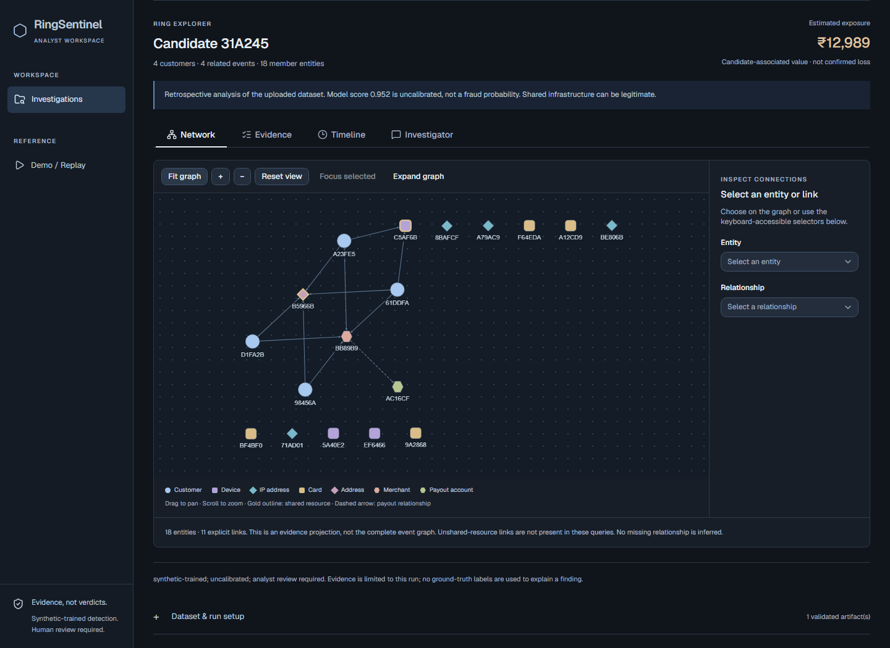
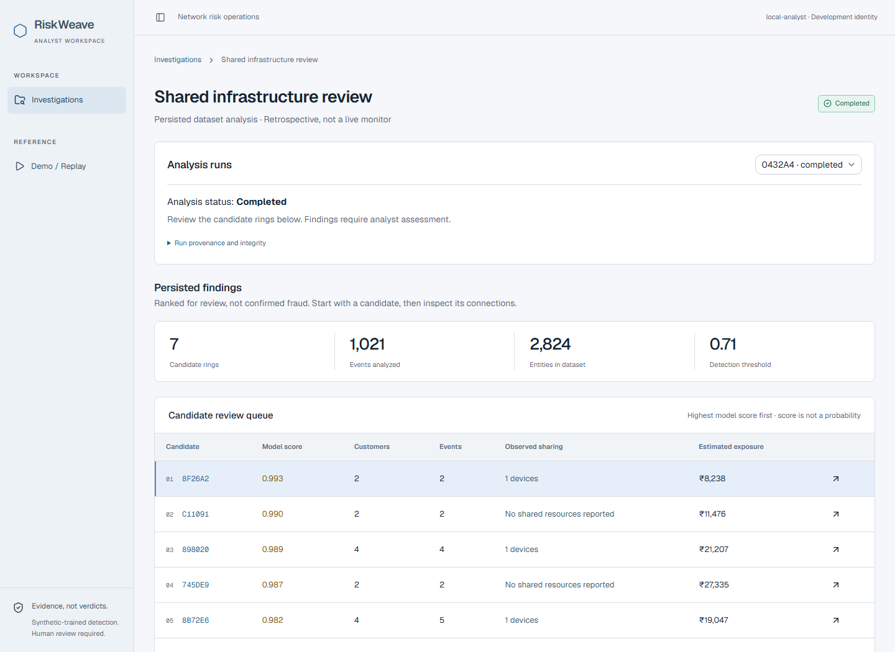
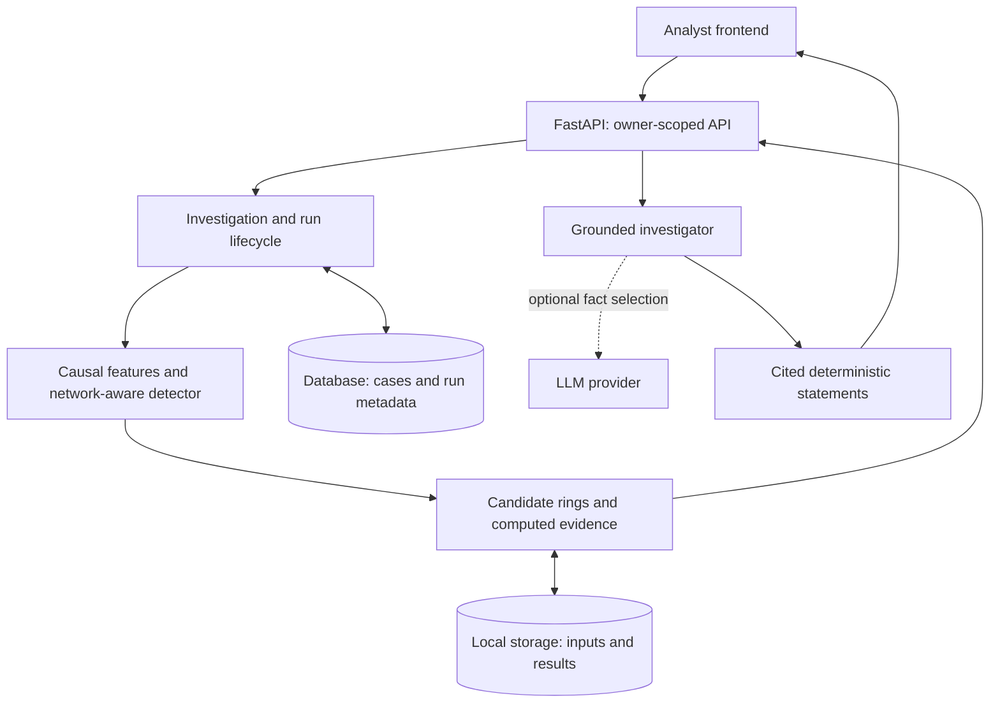

# RiskWeave

Network-aware payment-abuse detection, with evidence an analyst can inspect.

Coordinated abuse can hide inside individually ordinary payments. RiskWeave connects
transactions through shared infrastructure and activity patterns, ranks suspicious candidate
rings, and makes the relationships, timeline, and financial exposure reviewable.

**Evidence, not verdicts.** This is a working local analyst product with a synthetic-trained
detector—not a real-payment-validated fraud service. No GNN or paid API key is required.

Previously branded RingSentinel. The internal `ringsentinel` package, CLI commands,
configuration names, API paths, and historical benchmark artifacts are unchanged.



[Quick start](#quick-start) · [Screenshots](docs/assets/screenshots/README.md) ·
[Validation](#measured-validation) · [Watch demo](https://youtu.be/CaeExe9ePls)

## What it does

- **Find coordinated activity:** combines transaction, infrastructure-sharing, temporal, and
  structural graph features in a histogram-gradient-boosting model.
- **Keep investigations reproducible:** upload a validated dataset, run asynchronous analysis,
  and revisit saved findings with input/result checksums and run history.
- **Inspect evidence:** explore explicit network links, shared resources, merchant
  relationships, event timelines, and candidate-associated exposure.
- **Ask grounded questions:** the investigator cites computed facts. An optional LLM can
  select/order those facts; it cannot invent evidence or change detection decisions.
- **Compare simpler approaches:** a separate demo/replay workspace includes measured
  transaction and graph baselines, feature ablations, and legitimate hard-negative communities.

This helps an analyst move from a suspicious score to a reviewable case, while making the
limits of the evidence visible.

## Reviewer flow

**Create investigation → upload DatasetBundle → run analysis → review candidate rings →
inspect graph/evidence → read grounded investigator summary.**

The main workspace analyzes an uploaded dataset retrospectively. The separate `/demo` route
replays synthetic events chronologically; it is not a live payment integration.



## How the pieces fit



The **detector** scores events and groups candidates. The **evidence service** exposes only
computed graph/event information. The **investigator** explains that evidence using cited,
server-rendered statements—not free-form model-written findings.

**Stack:** Python, FastAPI, Pydantic, scikit-learn, NetworkX, SQLAlchemy/Alembic;
React/TypeScript, Vinext, Tailwind/shadcn, Cytoscape; pytest, Playwright, Ruff, Oxlint.
Local startup uses SQLite and filesystem storage. PostgreSQL support exists, but live
PostgreSQL/container verification remains outstanding. See [architecture](docs/architecture.md).

## Quick start

Prerequisites: a repository checkout, **Python 3.11+**, **uv**, and **Node.js 22.13+ with npm**.
The latest local verification used Python 3.14.6 and Node.js 24.19. Run from the repository root.

**Terminal 1 — install, migrate, and start the backend:**

```sh
uv sync --locked --extra dev
uv run --locked ringsentinel-migrate
uv run --locked ringsentinel-api
```

**Terminal 2 — install and start the frontend:**

```sh
cd frontend
npm ci
npm run dev
```

Open [the analyst workspace](http://127.0.0.1:5173/investigations).
[API documentation](http://127.0.0.1:8000/docs) is available in development mode.

**Terminal 3 — generate a reproducible upload from the repository root:**

```sh
uv run --locked python scripts/make_upload_sample.py --output work/sample.json --transactions 1000 --seed 105
```

Create an investigation, select `work/sample.json`, click **Upload dataset**, then **Start
analysis**. Wait for **Completed**, open a candidate, and try Network, Evidence, Timeline,
and Investigator. Sample creation refuses to overwrite an existing file; reuse it or
choose another output filename. First analysis may take tens of seconds on a laptop.

No `.env` or API key is needed. Defaults use local development identity, SQLite at
`work/ringsentinel.db`, and objects at `work/storage`. Keep both servers on loopback.
`.env.example` documents settings but is **not automatically loaded**; pre-existing shell
overrides still apply. Ingestion accepts a complete **DatasetBundle JSON**, not arbitrary CSV
or a single exported table. See [data contract](docs/data-model.md).

For build/preview commands, browser dependencies, and troubleshooting, see
[local setup](docs/quick-start.md). Do not expose development identity to a network.

## Measured validation

Phase 3 used five held-out synthetic ecosystems (seeds 101–105; 5,000 payments each, plus
refunds). Each fold trained on three seeds, selected its threshold on another, and tested on
the fifth. These are preserved experiment results, **not a new Phase 6 benchmark run**.

| Model | Precision | Recall | F1 | PR-AUC |
|---|---:|---:|---:|---:|
| Transaction rules | 0.126 | 0.058 | 0.080 | 0.056 |
| Transaction-only HGB | 0.627 | 0.154 | 0.243 | 0.199 |
| Static graph heuristic | 0.331 | 0.287 | 0.307 | 0.321 |
| Network-aware HGB | 0.964 | 0.939 | 0.951 | 0.971 |

Values are fold means. Network PR-AUC was **0.971 ± 0.005**; ring detection was **50/50** under
the benchmark's matching definition—not perfect member recovery. Exposure mean relative
error was **8.14%**, with **4.44% aggregate underestimation**. Detection and exposure accuracy
are separate measures.

The leakage audit found and corrected an unrealistic merchant-history shortcut; PR-AUC fell
from 0.979 to 0.971. Held-out merchant collusion was weaker and variable (**0.803 ± 0.143
PR-AUC**). Full ablations, false-positive rates, distributions, and weak results remain in the
[measured report](results/phase3/phase3_summary.md), [JSON artifact](results/phase3/phase3_results.json),
and [methodology](docs/benchmark-methodology.md).

Submission checks: **94 Python tests**, **27 frontend tests**, Ruff, frontend lint, TypeScript,
and production build passed. [Verification details](docs/submission-validation.md) record the
date, warnings, preserved SHA-256, and separately dated dependency audits.

### Run the checks

From the root:

```sh
uv run --locked --extra dev pytest -q
uv run --locked --extra dev ruff check .
```

With both local servers running in the default deterministic investigator mode,
run in `frontend`:

```sh
npx playwright install chromium
npm test
npm run lint
npm run typecheck
npm run build
```

Browser tests create local test investigations; use a separate local database/storage pair
to keep your presentation worklist uncluttered. See [setup details](docs/quick-start.md).

## Limitations and responsible use

- Synthetic-trained and synthetic-evaluated only. Distribution shift and real-payment
  performance are unknown; model scores are **not calibrated fraud probabilities**.
- Shared infrastructure can be legitimate. Candidates need human review; the application
  does not establish guilt or recommend automatic blocking.
- Exposure is candidate-associated value, **not confirmed loss**. Refund value replaces
  purchase value for the same original payment; synthetic expected-loss rates are assumptions.
- The investigator cannot establish model causality from an observed link. Default mode is
  visibly deterministic; optional paid-provider integration has not been live-verified.
- This is a single-host/local-storage foundation, not production approval. JWT verification
  is implemented, but real identity-gateway/TLS integration and live infrastructure checks
  remain unverified. Vinext is beta. See [Phase 5C verification and gates](docs/phase5c-final.md).

## Repository guide

```text
src/ringsentinel/  Generation, features, detection, evaluation, evidence,
                  simulation, API, and persisted investigation lifecycle
frontend/         Analyst workspace and browser tests
tests/            Python unit and integration tests
scripts/          Validated upload sample and local API smoke test
results/phase3/   Frozen measured benchmark JSON and report
docs/             Setup, architecture, methodology, security history, screenshots
docs/demo-script.md  2–4 minute recording plan
```

Start with [local setup](docs/quick-start.md), [screenshot gallery](docs/assets/screenshots/README.md),
or the [documentation index](docs/README.md). Historical reports and Phase 2 artifacts are retained.

## Demo video and project metadata

[](https://youtu.be/CaeExe9ePls)

**[Watch the RiskWeave demo on YouTube](https://youtu.be/CaeExe9ePls).** The
[recording script](docs/demo-script.md) is also available for reference. No hosted application
deployment is claimed.

Suggested GitHub description and topics are in [submission metadata](docs/submission-metadata.md).
Licensed under the existing [MIT License](LICENSE), credited to RingSentinel contributors.
