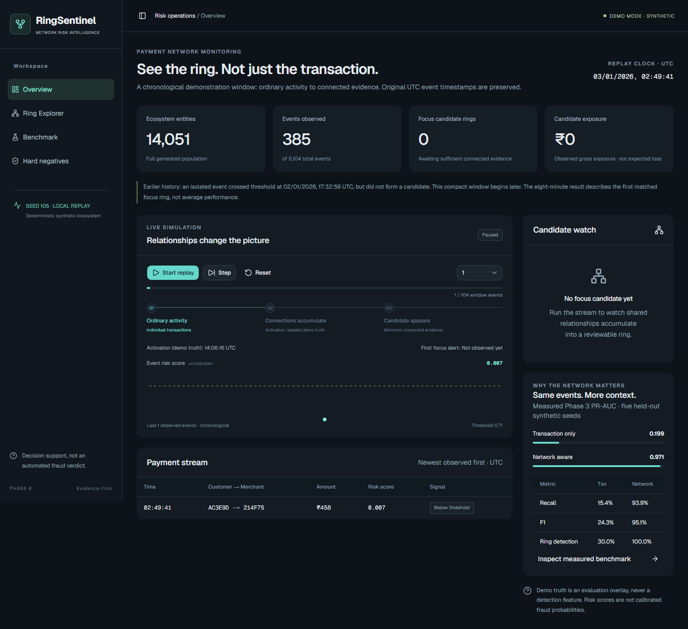

# RingSentinel

Temporal network intelligence for coordinated payment abuse.

RingSentinel is a working local analyst console for finding coordinated payment abuse that individual
transaction models can miss. It combines causal transaction, infrastructure, temporal, and graph
features, groups suspicious events into candidate rings, and exposes computed evidence to analysts.
The application includes FastAPI, a React/TypeScript dashboard, chronological simulation,
interactive network exploration, and an evidence-grounded investigator. Phase 5A adds persisted,
owner-scoped investigations, asynchronous runs, and a versioned API. Phase 5B makes this the primary
analyst workspace, with ranked findings, an evidence-linked graph, timeline and grounded investigator.
**No GNN is used.**

The key insight: a payment can look ordinary alone but suspicious in its network context. Sharing alone
is also insufficient: legitimate families, offices, and hostels are explicit benchmark hard negatives.

## Run the analyst workspace

Requirements: Python 3.11+, uv, Node 22.13+ (tested with Node 24.19), npm.
Run from this repository checkout. First setup needs internet for dependencies and fonts.

Terminal 1, repository root:

```powershell
uv sync --locked --extra dev
uv run ringsentinel-migrate
uv run ringsentinel-api
```

Terminal 2:

```powershell
cd frontend
npm ci
npm run dev
```

Open **http://127.0.0.1:5173**. API docs: http://127.0.0.1:8000/docs.
These `uv` and `npm` commands also work from a Linux shell. Run migration explicitly before startup;
the API never creates tables implicitly. Settings come from the launching environment, not automatic
`.env` loading. The defaults use SQLite `work/ringsentinel.db` and local objects in `work/storage`.
The primary page is the persisted investigation worklist. The separate **/demo** route may take
roughly 20–40 seconds on its first data request to reproduce the held-out seed-105 fold.
Use localhost only; this is not a hardened public deployment. Ctrl+C stops each terminal.
Stop the backend before changing Python package metadata/installing: Windows locks running launchers.

For a local production-build preview, stop the frontend dev server and run `npm run build`, then
`npm start` from `frontend`. Both modes forward `/api` to the local Python process.
The migration initializes the local database. No generated dataset, paid account, or LLM key is
required for the synthetic demo. Uploaded investigations use the separate persisted workflow below.

Open **http://127.0.0.1:5173/demo** to start replay, watch the first focus candidate appear, open Ring Explorer, inspect its graph/timeline,
ask “Why was this ring flagged?”, then visit Benchmark and Hard negatives. Follow the
[3–5 minute demo script](docs/demo-flow.md). Replay speed compresses waiting, not event timestamps.
The first live candidate is an observed-prefix snapshot; the sidebar Explorer is retrospective.

## Persisted investigations

Open **http://127.0.0.1:5173/investigations** to create an investigation, upload a sample, start analysis,
and revisit its persisted results. Generate a single uploadable JSON bundle from the repository root:

```powershell
uv run python scripts/make_upload_sample.py --output work/sample.json --transactions 1000 --seed 105
```

The upload contract is a complete synthetic `DatasetBundle` JSON object, not CSV, a ZIP, or a single
JSONL table from the older generator CLI. Labels are part of the validated input format but never
participate in fitting/scoring uploaded events. The detector is still synthetic-trained and uncalibrated.
Inputs are limited to 25 MB by default. Generated samples, databases, and stored evidence stay ignored.

The local development session defaults to `local-analyst`. `X-Development-User` allows integration
tests/local requests to exercise different owners; it is **not authentication**. Keep the app local.
Production mode rejects this mechanism and denies protected routes until a real identity adapter exists.

A PowerShell API example, with the backend already running:

```powershell
$api = 'http://127.0.0.1:8000/api/v1'
$owner = @{ 'X-Development-User' = 'local-analyst' }
$investigation = Invoke-RestMethod "$api/investigations" -Method Post -Headers $owner -ContentType 'application/json' -Body '{"name":"Sample review"}'
$artifact = Invoke-RestMethod "$api/investigations/$($investigation.id)/artifacts" -Method Post -Headers $owner -ContentType 'application/json' -InFile work/sample.json
$runHeaders = @{ 'X-Development-User' = 'local-analyst'; 'Idempotency-Key' = [guid]::NewGuid().ToString() }
$body = @{ artifact_id = $artifact.id } | ConvertTo-Json
$run = Invoke-RestMethod "$api/investigations/$($investigation.id)/runs" -Method Post -Headers $runHeaders -ContentType 'application/json' -Body $body
Invoke-RestMethod "$api/runs/$($run.id)" -Headers $owner
```

Repeat only the final GET to poll `queued` → `running` → `completed`/`failed`. Once completed, GET
`/api/v1/runs/{id}/rings` or `/api/v1/runs/{id}/results`. An empty ring list is a valid completed result.
Reuse the same idempotency key if an enqueue response is lost; do not generate a new key for a retry.
Historical investigations survive backend restarts when the database and storage location are retained.
Run **one API worker**: the local database queue executes one killable child at a time, with a default
300-second timeout. This is not a distributed worker system.

Frontend transport is centralized. `NEXT_PUBLIC_RINGSENTINEL_API_BASE_URL` is an optional build-time
API origin (no `/api` suffix); empty uses same origin. `RINGSENTINEL_API_PROXY_TARGET` controls the
server-side proxy; set it when building and starting if the backend is not `http://127.0.0.1:8000`.
Configure matching explicit `RINGSENTINEL_FRONTEND_ORIGINS` on the backend for cross-origin use.
Persisted detail links use `/investigations/{id}?run={run_id}&ring={candidate_id}&view={tab}`.
Completed runs open a ranked candidate queue. Select a ring, inspect Network / Evidence / Timeline,
then ask the grounded Investigator. Dataset setup collapses after completion. The network is a
projection of explicit evidence-query relationships, not a reconstruction of missing event links.
The persisted timeline is retrospective; only the separate demo replay makes prefix-safe observations.
See [Phase 5B frontend architecture and verification](docs/phase5b-frontend.md).

Health: `/api/v1/health`; readiness: `/api/v1/ready`. Errors carry safe codes/messages and an
`X-Request-ID`; request logs use the same ID without logging uploads or evidence. See
[production architecture](docs/PRODUCTION_ARCHITECTURE.md) and [.env.example](.env.example) for settings,
ownership, all endpoint contracts, execution limits, and remaining deployment gates.

## Local container recipe

Docker is optional. The Compose recipe builds the backend and production frontend, migrates PostgreSQL,
and binds application ports to loopback only. Supply an untracked local database password via the shell:

```powershell
$env:RINGSENTINEL_DB_PASSWORD = 'replace-with-a-local-only-password'
docker compose config --quiet
docker compose build
docker compose up --wait
```

On Linux use `export RINGSENTINEL_DB_PASSWORD='replace-with-a-local-only-password'` first, then the same
Compose commands. The stack explicitly uses development identity for local testing; it is not a secure
public deployment. Keep named database/artifact volumes to preserve investigations.
Docker/Podman/WSL were unavailable on the development host: image builds, live PostgreSQL, and the
container investigation smoke test remain unverified locally. Do not interpret these recipes as a
successful container run. See [container verification](docs/container-verification.md). GitHub Actions
includes validation jobs but must actually run after pushing.

## Measured synthetic benchmark

Post-hardening Phase 3 means over five held-out ecosystems; unchanged in Phases 4, 5A and 5B:

| Model | PR-AUC | Precision | Recall | F1 | Event FPR | Ring detection |
|---|---:|---:|---:|---:|---:|---:|
| Transaction-only HGB | 0.199 | 0.627 | 0.154 | 0.243 | 0.55% | 30% |
| Graph heuristic | 0.321 | 0.331 | 0.287 | 0.307 | 2.75% | 28% |
| Network-aware HGB | 0.971 | 0.964 | 0.939 | 0.951 | 0.17% | 100% |

Exposure mean relative error: **8.14%**; aggregate underestimation: **4.44%** over 50 matched rings.
Detection recall does not establish valuation accuracy. Expected-loss rates are synthetic assumptions,
and scores are not calibrated probabilities. The eight-minute seed-105 example is not average latency:
the benchmark mean early-warning delay is about 20.95 hours. An earlier isolated threshold alert is
explicitly disclosed in the compact replay.

Validated on synthetic ecosystems; **not a production fraud-rate claim**. Distribution shift is unknown.
Merchant-collusion held-out PR-AUC varies (0.803 ± 0.143). Production needs retraining and monitoring.
Full results, standard deviations, ablations, and before/after hardening are preserved in
[Phase 3 results](results/phase3/phase3_summary.md) and [methodology](docs/benchmark-methodology.md).

## Investigator trust boundary

The question selects controlled evidence queries. The investigator never classifies fraud, invents
missing evidence, or changes the detector. Default mode is deterministic, with cited observations and
inspectable source data. Optional OpenAI extractive summarization selects/orders computed facts; it
cannot introduce free-form claims. Errors or invalid selections fall back safely. Configure server-side
environment variables from `.env.example` only if desired; `.env` is not auto-loaded.
See [investigator design](docs/investigator-design.md). Live paid-provider verification is not claimed.

## Screenshots

Browser-generated screenshots are in [docs/screenshots](docs/screenshots). Repeatable UI tests also
write current captures to ignored `outputs/phase4-*.png`.



## Checks

```powershell
uv run pytest -q
uv run ruff check .
uv build
cd frontend
npm run lint
npm run typecheck
npm run build
npx playwright install chromium
npm test
```

Browser tests require both servers running and use actual API data, not mocked benchmark responses.
The new upload/revisit test generates a real dataset through the installed Python environment.
Two additional transport-fixture tests cover unauthorized/offline/empty/failed UI states only.
The optional WebMCP contract is tested with an emulated registry; native browser support is not assumed.
Bundled shadcn catalog lint findings are excluded from application lint; all TypeScript is typechecked.
Phase 4's dependency audit found 8 high, 2 moderate, and 1 low advisory. Phase 5A reviews safe updates
without changing the detector; consult the current [dependency review](docs/dependency-audit.md) and
[verification log](docs/phase5a-verification.md) for measured outcomes and unresolved findings rather
than treating the historical count as current. A large-chunk build warning is not a fraud-model result.
Keep the application local until the documented security and deployment gates are met.

## Repository map

```text
src/ringsentinel/  generation, schemas, causal features, models, evaluation
  api/            FastAPI + deterministic held-out demo runtime
  platform/       owned persistence, migrations, storage, subprocess lifecycle, settings
  investigation/  read-only evidence + constrained investigator providers
  simulation/     chronological candidate replay
frontend/         React/TypeScript operations console + browser tests
tests/            schema, leakage, benchmark, evidence, replay, persistence/API/provider tests
results/phase3/   preserved measured validation artifacts
docs/             architecture, methodology, evidence contract, demo script
Dockerfile*       production-compatible backend/frontend image recipes
compose.yaml      local-only PostgreSQL, migration, backend, frontend recipe
.github/          validation CI; no deployment automation
```

See [production architecture](docs/PRODUCTION_ARCHITECTURE.md),
[foundation ADR](docs/adr/0001-persisted-analysis-foundation.md), the original
[detection architecture](docs/architecture.md), and [snapshot evidence contract](docs/evidence-ui.md).

## Synthetic data and experiment CLI

```powershell
uv sync --locked --extra dev
uv run ringsentinel-generate --seed 42 --transactions 1000 --output data/generated/demo
uv run pytest
```

Equivalent module invocation:

```powershell
uv run python -m ringsentinel.generate --seed 42 --transactions 1000
```

For a separate research run only, the five-seed benchmark command is:

```powershell
uv run python -m ringsentinel.experiments.run --transactions 5000
```

Measured fold, scenario, hard-negative, candidate, exposure, threshold, and runtime outputs are written
to `results/phase2/`.

The Phase 3 validation suite's historical reproduction command is:

```powershell
uv run ringsentinel-phase3 --transactions 5000
```

Do not run it against the preserved Phase 3 result directory during architecture/UI work. It writes
controlled feature ablations, held-archetype generalization, permutation importance,
feature-distribution checks, exposure error, a hardened before/after benchmark, and replay milestones to
`results/phase3/`.

Generated datasets contain JSON Lines entity, event, and label tables plus ring and benign-community
ground truth, a manifest, and SHA-256 checksums. `--transactions` counts payment/capture events;
refund events are additional linked events.

The default ring-payment budget is 5% of payment volume while retaining all ten archetypes. Because
refund-abuse setup purchases and camouflage activity are not fraud-labeled, actual event prevalence is
measured from generated labels and may differ slightly. Override the budget with `--fraud-ratio`.

See [docs/data-model.md](docs/data-model.md) for the schema and ground-truth contract.
