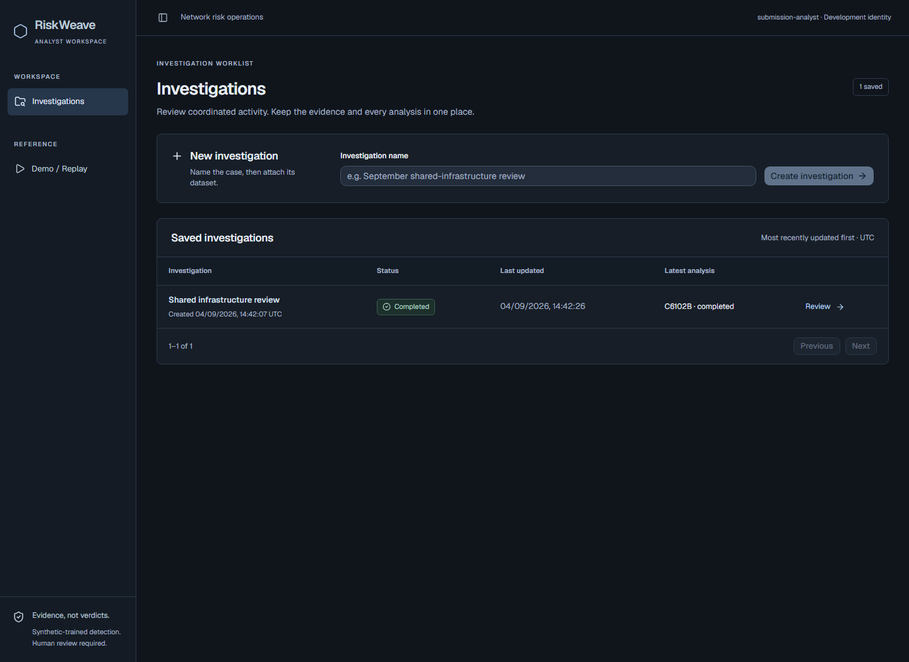
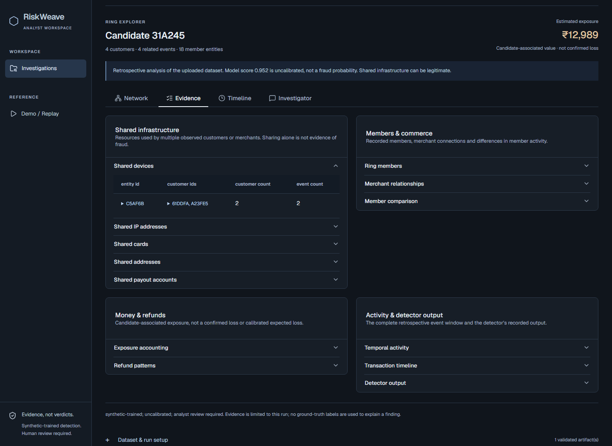
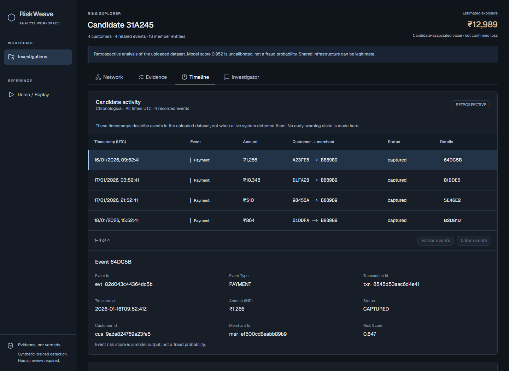
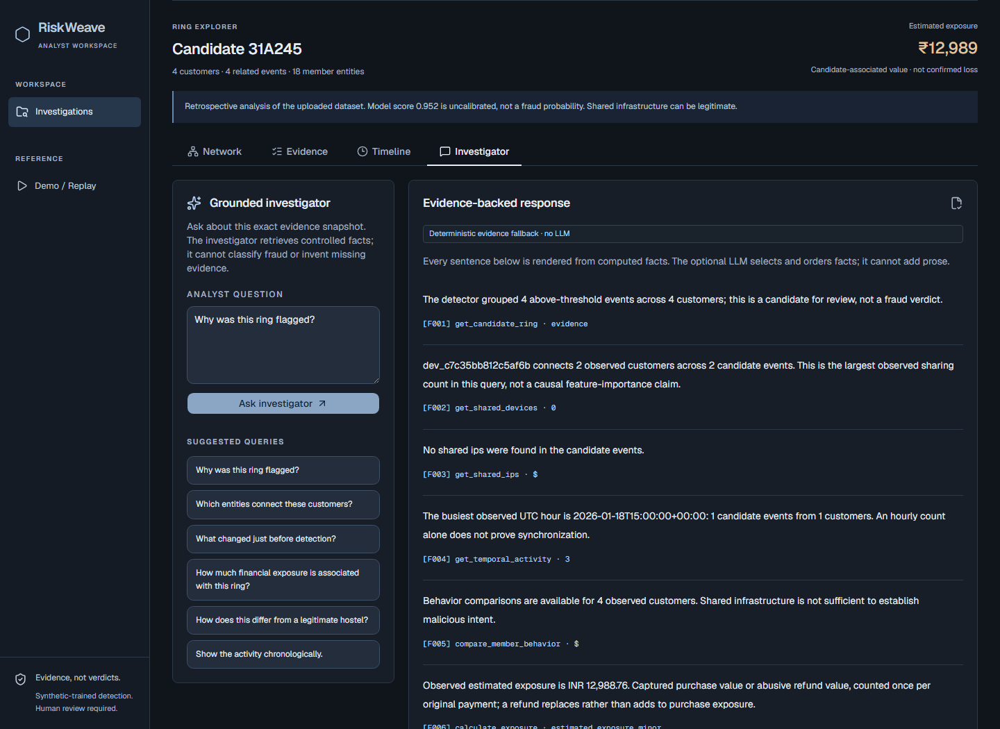

# RiskWeave screenshots

Refreshed on 2026-09-04 after the public RiskWeave rename, at 1440 × 1050.
Only display branding changed; the Phase 5C application behavior and saved analysis are unchanged.
These are real local browser captures—not mockups, altered evidence, or fixture responses.
The Sites skill guided preservation of the existing interface and local visual review;
no site was registered or deployed.

## Provenance

- A dedicated local development identity has one investigation: **Shared infrastructure review**.
- The unchanged generator used seed **105**, **1,000 payments**: **2,824 entities, 1,021 events**.
- The real UI uploaded `payment-ecosystem.json`, ran analysis, and persisted **7 candidate rings**.
- The detailed views show candidate **31A245**: 4 customers, 4 related events, 18 member entities.
  It was chosen for visible device/address sharing, not as a claim about all detected rings.
- The investigator is explicitly **deterministic evidence fallback · no LLM**. No paid call occurred.
- The gallery contains no real payment/customer data, credentials, personal filesystem paths,
  browser consoles, or test-case clutter. Synthetic entity IDs and local development identity
  are visible deliberately. Earlier development screenshots remain historical and unchanged.

Reproduce the flow with [local setup](../../quick-start.md); generated datasets, local
databases, and browser automation scratch files are intentionally not committed.

## Investigations

One saved investigation, with its completed analysis available to reopen.

## Completed investigation

Persisted candidate queue; scores and exposure are explicitly qualified in the UI.

## Ring Explorer

Only query-provided links are rendered. Unlinked member entities remain visible; missing
relationships are not invented to make the graph look more connected.

## Evidence

Expanded sharing query with observed customer/event counts.

## Timeline

Original UTC event timestamps and selected-event details. This uploaded-dataset view is
retrospective and makes no live early-warning claim.

## Investigator

Computed, cited statements with the no-LLM mode visible. The screenshot is a viewport,
not the entire scrollable response; citations open source evidence in the application.

